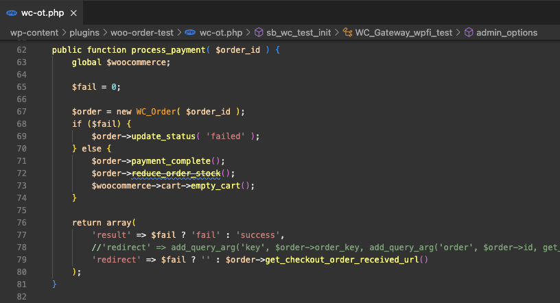

# Payment Method Logger

This plugin saves a log of all successful WooCommerce orders.

This log can be visualized in a meta box in the order edit page in the admin.

In case of a failed or cancelled order a POST request will be sent to a webhook URL with the details.

Inside the WooCommerce menu you will find a "Logger fallback" submenu to setup this webhook URL.

Tested with WooCommerce Order Test plugin.

<u>Note:</u> The **WooCommerce Order Test** plugin doesn't work with Gutenberg blocks, so in order to work with it you should go to the checkout page, open it in code view and replace the default block-based content with the shortcode ```[woocommerce_checkout]```

### Testing failures

We can simulate failed payments by tweaking around a little bit the Order Test plugin.

By applying the changes shown below, we can then switch the value for the  ```$fail``` variable from 0 to 1 to enable or disable failed payments.

